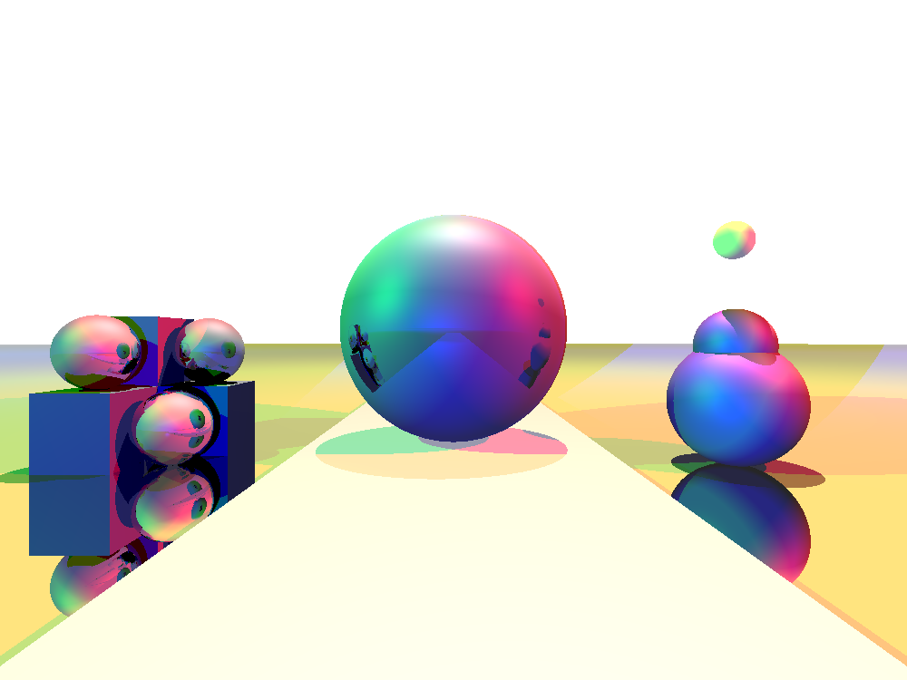

# Ray-Tracing-N7

This is a school project of students of the ENSEEIHT engineering school, in which we will try to recreate a basic ray tracing system, with a graphical interface, in which we will be able to visualize differents 3D Objets in a customizable scene.

